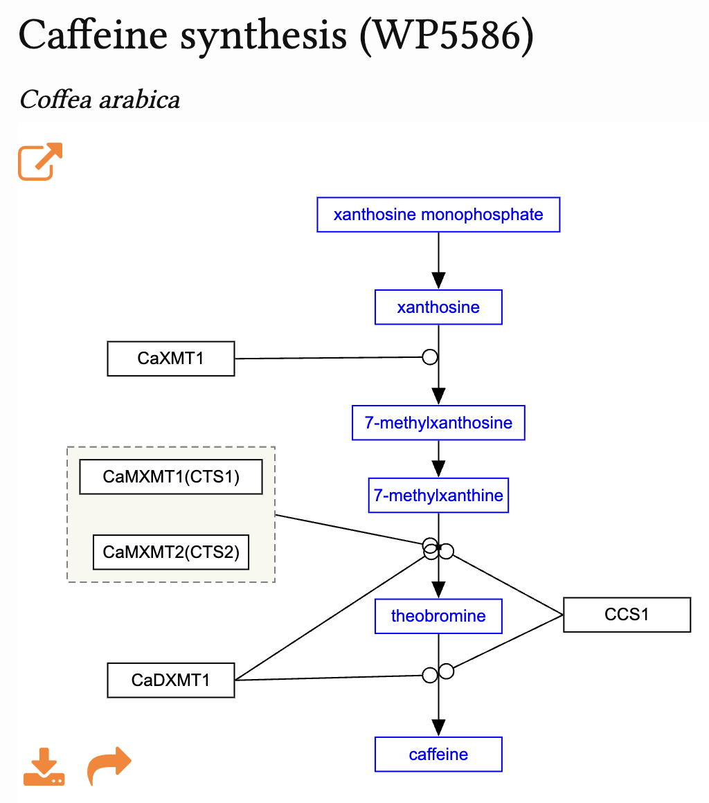
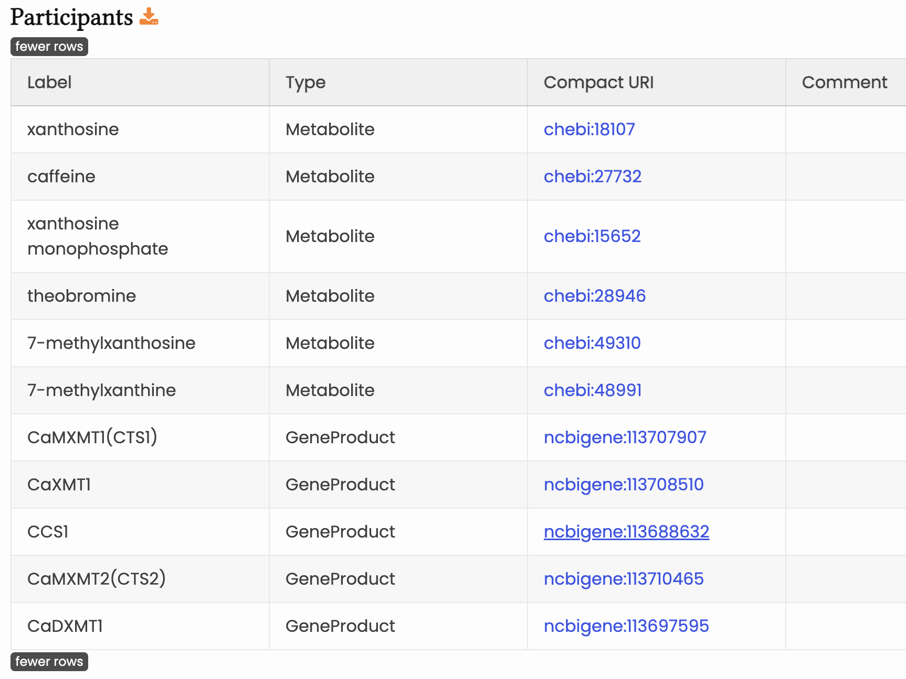

# Abstract 

Building on our work at DBCLS BioHackathon 2023 (BH23), where we introduced QPX and promoted pathway modeling with WikiPathways (Pico et al., 2008) using PathVisio (Kutmon et al., 2015), we now focused on creating new pathway diagrams for diverse species and registering them in WikiPathways with functional annotations. In parallel, we deployed WikiPathways node data into Elasticsearch to enable fast and flexible search and integration of pathway information.

# Introduction

The ability to acquire large-scale data in life science research, exemplified by the Next-Generation Sequencing (NGS), has made life science data analysis critically important [@BonoIJMS2025]. 
In particular, enrichment analysis targeting gene groups with altered expression is frequently performed.
This is made possible by various ontologies, such as Gene Ontology (GO) [@GeneOntology], and the annotation of genes and transcripts.

Pathway is one of such ontology, and pathway diagrams, graph representation of accumulated knowledge, have been used for biological interpretation not only in humans but across all species. 
The advent of enrichment analysis has also enabled the utilization of annotation information for all genes contained in those pathways.
Specifically, groups of enzyme genes belonging to specific pathways, such as glycolysis or lipid metabolism, are used in enrichment analysis in addition to their GO annotations.
As a result, enrichment analysis identifies metabolic pathways that significantly contain groups of genes showing altered expression, enabling their use for biological interpretation.

However, this enrichment analysis alone only provides information on which genes are associated with each pathway.
The information on which part of the pathway they are used in is not fully utilized.

Therefore, at DBCLS BioHachathon 2023 (BH23), we developed a pathway analysis environment for non-model organisms and created analytical methods that can utilize this information [@BH23rep] [@BH23JPrep].
Subsequently, it became clear that these applications were not limited to non-model organisms; they are also crucial for research in model organisms visualizing pathways not listed in existing pathway databases such as Kyoto Encyclopedia of Genes and Genomes (KEGG) [@KEGG]. 
The knowledge of pathways that should be systematized is not currently digitized in pathway databases; it must be created for each specific research theme. Demand for this is expected to increase in the future.
To achieve this, pathway databases need to be democratized, requiring a Wikipedia-like pathway database.
To address this, WikiPathways serves as an open-access platform for sharing and editing information on biological pathways such as metabolic and signaling pathways [@WikiPathways].
One project undertaken within WikiPathways is Pathway Figure OCR (PFOCR) [@PFOCR].
PFOCR is a project that extracts genes and compounds from static images within papers on PubMed Central (PMC) that contain pathway diagrams. It uses Artificial intelligence (AI) and Optical Character Recognition (OCR) technology to extract these elements from the images within the papers and reconstruct them as WikiPathways models. This is an extremely useful initiative for extracting relationships between genes and other components.

Following the stimulating discussions at BH23, we have developed a system called Quest for Pathways with expression (QPX), which utilizes the WikiPathways framework to integrate gene expression quantitative data into pathway diagrams.

In DBCLS BioHackathon 2025 (BH25) in Mie, on-the-job training was conducted to actually create useful substance production pathways, utilizing the available tools and training materials provided by WikiPathways Academy (https://academy.wikipathways.org). In parallel, we deployed WikiPathways node data into Elasticsearch to enable fast and flexible search and integration of pathway information.

# Results and Discussion

Following the comppilation of stimulus discussions at BH23 in Shodoshima and BH23.9 in Shirahama summerized in our reports [@BH23rep] [@BH23JPrep], the discussions were continued at BH25 in Mie to make QPX more usable.
At BH25, we worked on the following points towards pathway data development  in non-model organisms alongside six new members (2 undergraduate students, 3 graduate students and 1 doctoral researcher) from bonohulab in Hiroshima University.

## Tutorial on drawing pathway diagrams

In order to be utilized in the system developed, we encourage researchers to create pathway diagrams in XML called Graphical Pathway Markup Language (GPML).
The WikiPathways project already has developed software with graphical user interface called PathVisio [@PathVisio].
Six new members gave a brief tutorial how to draw pathway diagrams by PathVisio (version3.3.0) in BH25.

## Drawing pathway diagram and adding annotations

Continuing from BH23, we attempted to create pathway diagrams and develop a technique to reduce such effort by creating pathway diagrams in non-model organisms.
10 new pathways were created during BH25 (Table 1).
Reference pathway diagrams were searched from PMC utilizing PFOCR.
NCBI GeneIDs
We have standardized the practice to prioritize annotating NCBI GeneIDs as gene identifiers.

Pathway diagrams with annotations produced were registered on WikiPathways by referring Academy and with great assistance by WikiPathways team.
  
Table 1: New pathways created in BH25

| Pathway | Species | WP \# |
| -------- | --------  | -------- |
| Caffeine synthesis   | *Coffea arabica* | `WP5586` |
| | *Theobroma cacao*  | `WP5588` |
| | *Citrus sinensis*  | `WP5589` |
| | *Paullinia cupana* | `WP5590` |
| | *Ilex paraguariensis* | `WP5591` |
| Nicotine biosynthesis | *Nicotiana tabacum* | `WP5595` |
| 2-phenylethanol biosynthesis | *Saccharomyces cerevisiae* | `WP5587` |
| Isoflavone biosynthesis | *Glycine max* | `WP5593` | 
| Mugineic acid biosynthesis | *Oryza sativa* | `WP5596` |
| Biochemical pathway of glycinebetaine | *Arabidopsis thaliana* | `WP5597` |

Figure 1: Pathway diagram for Caffeine synthesis in *Coffea arabica*. This diagram is already published in WikiPathways at https://www.wikipathways.org/pathways/WP5586.html

Figure 2: Participants in Caffeine synthesis pathway in *Coffea arabica*. This data is already published in WikiPathways at https://www.wikipathways.org/pathways/WP5586.html

## Development of Pathway Data Production Support System

We also developed a pathway data production system to enhance the searchability of WikiPathways data.
We deployed WikiPathways node data into Elasticsearch to enable fast and flexible search and integration of pathway information.

# Future work

Not only will we expand the number of pathway diagrams and their annotations, but we will also increase the number of researchers capable of creating them.
Furthermore, we will enable many people to utilize the created data on QPX.

# Acknowledgements

We thank Dr. Alex Pico for the continuous support from BH25 to the project.
We also thank Dr. Egon Willighagen for curating pathways created and inclusion to WikiPathways.
We deeply thank organizers of BH25 at Mie (14-20 September 2025) for giving us a chance to discuss the system.

# References
